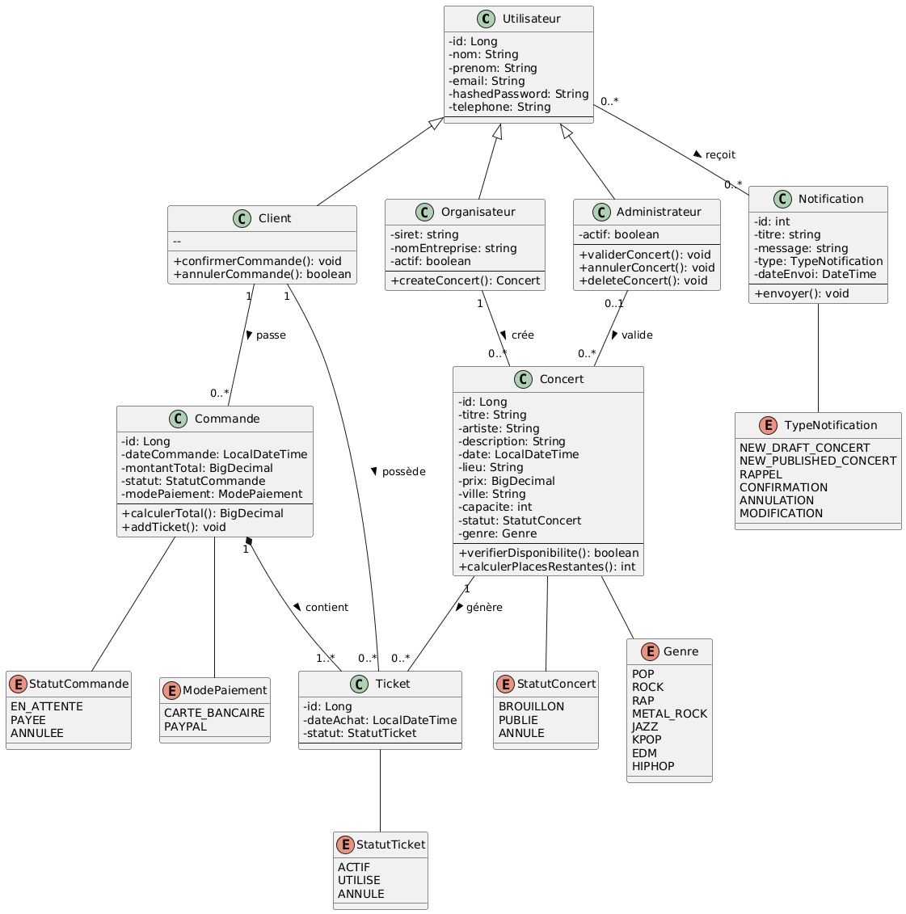
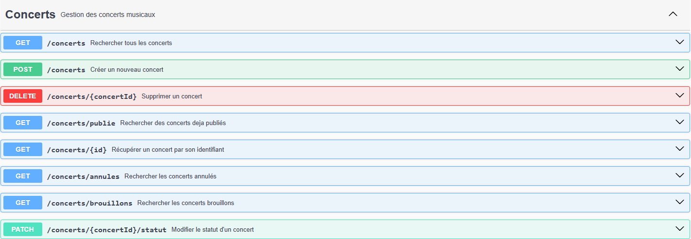
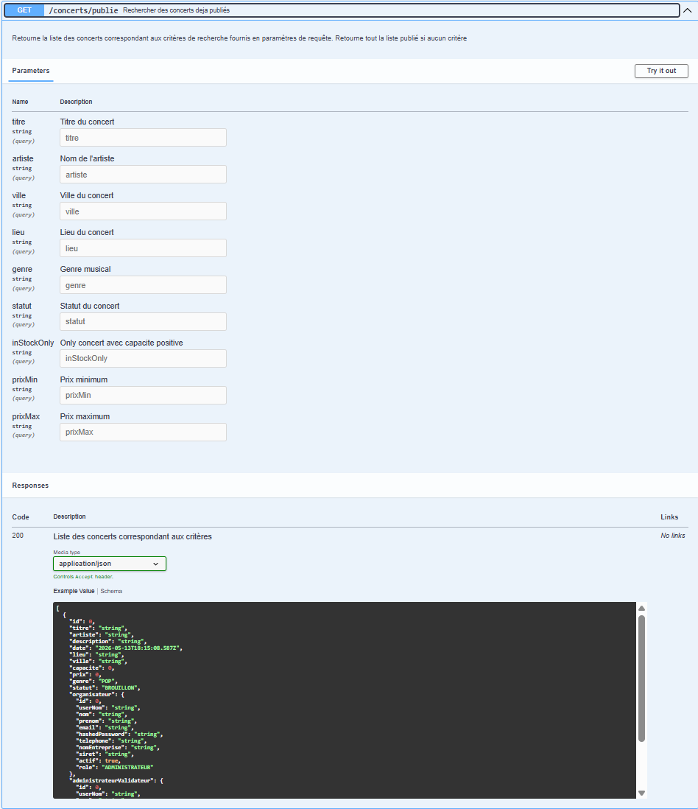

# Concert Ticketing - Backend

## 1. Présentation du projet

Modèle métier et diagramme de classes

Le backend repose sur un modèle métier centré sur la gestion de concerts, de commandes, de tickets et de notifications.

L'objectif principal est de permettre à des organisateurs de proposer des concerts, à des administrateurs de les valider ou de les annuler, et à des clients d'acheter des tickets via un système de panier représenté par une commande.

## 2. Diagramme de classes



## 3. Fonctionnement métier

<h3>Création d'un concert ( Seul l'**organisateur** est autorisé à créer un concert )</h3>

Lorsqu'un organisateur crée un concert :

Le backend vérifie les données envoyées.
Le concert est créé avec le statut _BROUILLON_.
Une notification NEW_DRAF_CONCERT est envoyée aux administrateurs.

**Publication d'un concert ( Seul l'**administrateur** est autorisé à publier un concert )**

Lorsqu'un administrateur publie un concert :

Le statut du concert passe de _BROUILLON_ à _PUBLIE_.
L'organisateur reçoit une notification _CONFIRMATION_.
Les clients reçoivent une notification _NEW_PUBLISHED_CONCERT_.


<h3>Annulation d'un concert ( Seul l'**administrateur** est autorisé à annuler un concert )</h3>

Lorsqu'un administrateur annule un concert :

Le statut du concert devient _ANNULE_.
Tous les tickets liés à ce concert passent au statut _ANNULE_.
L'organisateur reçoit une notification _ANNULATION_.
Les clients ayant un ticket pour ce concert reçoivent une notification indiquant que leur ticket est annulé.


<h3>Suppression d'un concert ( Seul l'**administrateur** est autorisé à supprimer un concert )</h3>

Si le concert n'a pas encore de ticket associé : il peut être supprimé définitivement.

Si le concert possède déjà des tickets :
il n'est pas supprimé physiquement ;
son statut passe à _ANNULE_ ;
les tickets liés passent au statut _ANNULE_ ;
les utilisateurs concernés sont notifiés.

Cette approche évite de supprimer des données importantes liées à l'historique des commandes.

<h3>Panier et commande ( Seul l'**client** est autorisé à ajouter un concert au panier & confirmer commande)</h3>

Le panier d'un client est représenté par une commande au statut _EN_ATTENTE_.

Lorsqu'un client ajoute un concert au panier :

Le backend cherche une commande _EN_ATTENTE_ pour ce client.
Si elle existe, le ticket est ajouté dans cette commande.
Sinon, une nouvelle commande _EN_ATTENTE_ est créée.
Un nouveau ticket est créé et lié à la commande et au concert.
Le total de la commande est recalculé.

Lorsqu'un client confirme le panier :

La commande passe au statut _PAYEE_.
La capacité du concert est diminuée selon le nombre de tickets achetés.
Les tickets restent visibles dans les commandes du client.

<h3> Ticket </h3>

Un ticket représente une place pour un concert.

Un ticket est lié à :
une commande
un concert

Le ticket n'est pas directement lié au client. Pour retrouver le client d'un ticket, on passe par :
Ticket -> Commande -> Client
Cette modélisation évite les doublons et les incohérences entre Ticket.client et Ticket.commande.client.

<h3>Notification</h3>

Les notifications permettent d'informer les utilisateurs lors d'événements importants.

Exemples :

un administrateur reçoit une notification _NEW_DRAFT_CONCERT_ quand un organisateur crée un nouveau concert _BROUILLON_

un organisateur reçoit une notification _CONFIRMATION_ quand son concert est _PUBLIE_ ou _ANNULE_

un client reçoit une notification _NEW_PUBLISHED_CONCERT_ quand un concert publié est disponible par administrateur

un client reçoit une notification _ANNULATION_ si son ticket est annulé

## 4. Endpoints principaux

<h3>Exemple: Concert</h3>


### GET `/concerts/publie`

Cet endpoint permet de récupérer la liste des concerts publiés visibles sur le site public.  
Il peut être utilisé sans critère afin de retourner tous les concerts au statut `PUBLIE`, ou avec des paramètres de recherche pour filtrer les résultats par titre, artiste, ville, lieu, genre, prix minimum, prix maximum ou disponibilité.

Le paramètre `inStockOnly=true` permet de retourner uniquement les concerts dont la capacité restante est positive.

Exemple :

```http
GET /concerts/publie?ville=Paris&genre=ROCK&inStockOnly=true
```

