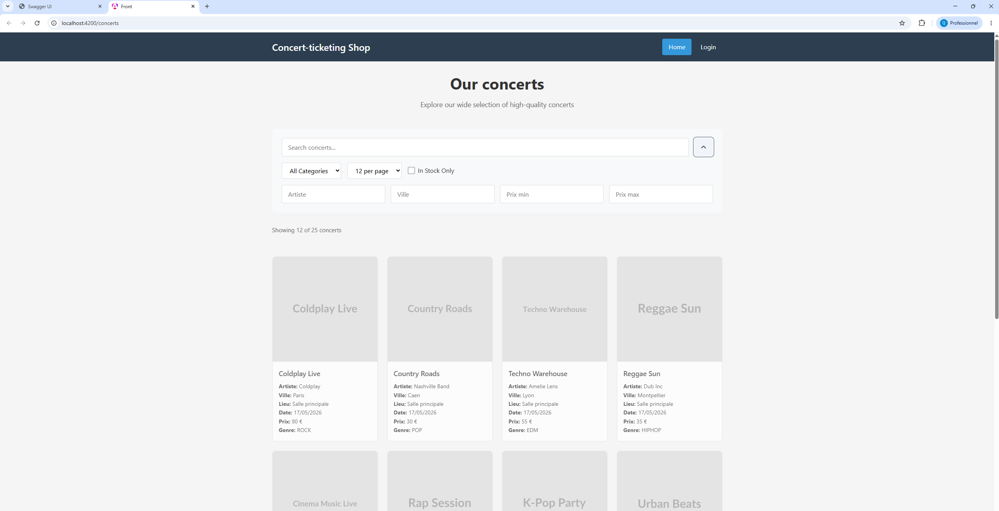
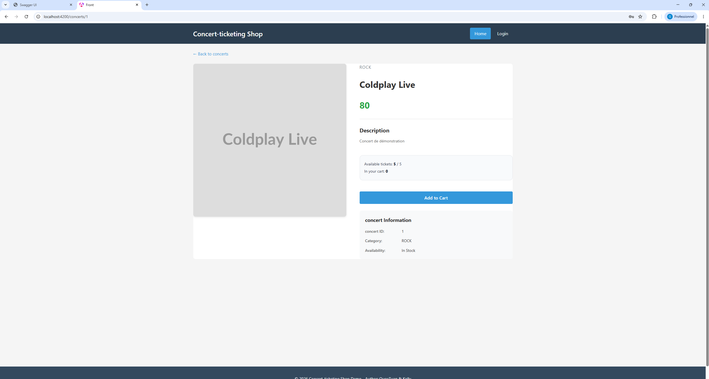
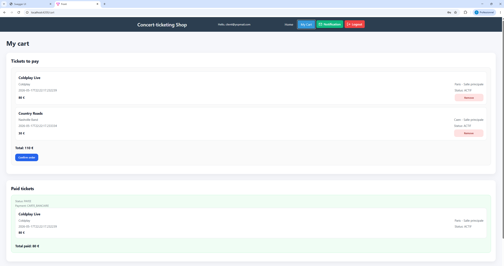
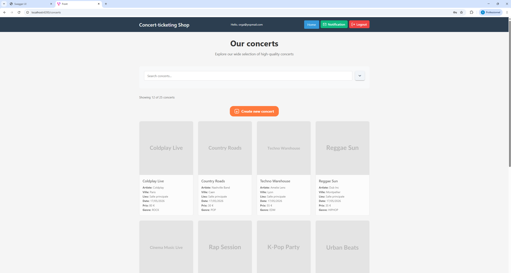
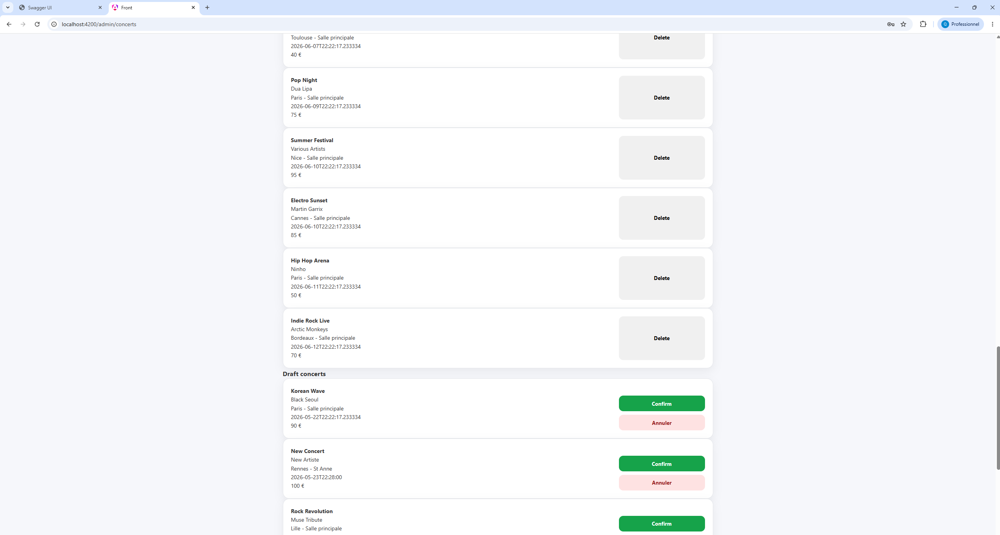
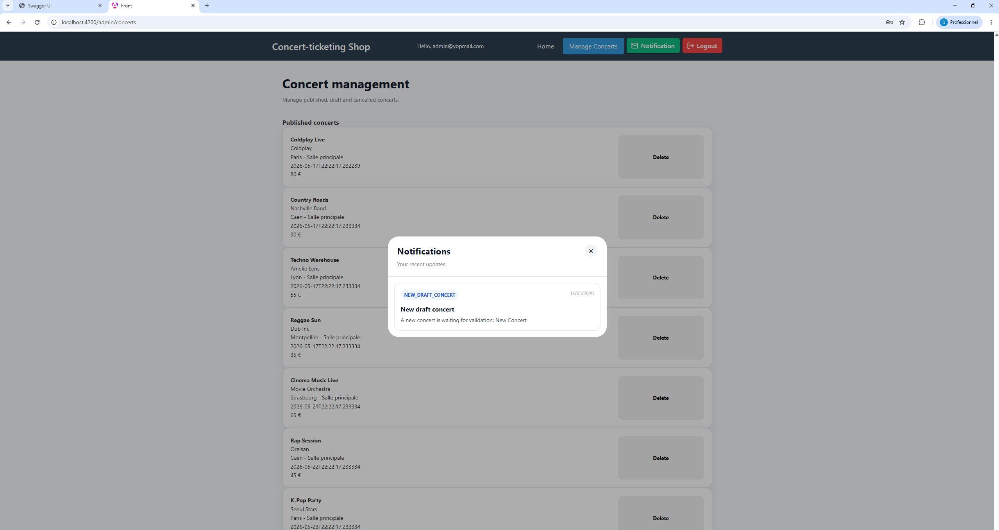

# Front

This project was generated with [Angular CLI](https://github.com/angular/angular-cli) version 18.2.11.

## Development server

Run `ng serve` for a dev server. Navigate to `http://localhost:4200/`. The application will automatically reload if you change any of the source files.

## Build

Run `ng build` to build the project. The build artifacts will be stored in the `dist/` directory.

## 3 comptes disponible depuis Backend -> DataInitializer:

### Admin

admin@yopmail.com

passw0rd

### Organisateur

organisateur@yopmail.com

passw0rd

### Client

client@yopmail.com

passw0rd

## Fonctionnalités développées par profil utilisateur

L'application a été développée avec une logique de séparation des fonctionnalités selon le rôle de l'utilisateur connecté.  
Chaque type d'utilisateur dispose donc d'une interface et d'actions adaptées à ses droits métier.

---

### 1. Site public

Le Homepage est accessible sans authentification.

Il permet de :

- consulter uniquement les concerts publiés ;
- rechercher un concert par titre, artiste, ville, genre ou prix ;
- filtrer les concerts disponibles avec le critère `inStockOnly` ;
- accéder à la page de connexion.

```http
GET /concerts/publie
```



---

### Détail d'un concert

Le page Détail d'un concert est accessible sans authentification.

Cette page permet de consulter les informations principales du concert :

- titre ;
- artiste ;
- genre ;
- prix ;
- description ;
- disponibilité ;
- nombre de tickets disponibles ;
- nombre de tickets déjà ajoutés au panier.

Si l'utilisateur est connecté en tant que client, il peut ajouter le concert à son panier directement depuis cette page.

```http
GET /concerts/{id}
```

La disponibilité est calculée à partir de la capacité restante du concert.  
Le bouton `Add to Cart` est désactivé lorsque le nombre de tickets ajoutés au panier atteint la capacité disponible.



---

### 2. Espace client

Le client dispose d'un espace orienté achat de tickets.

Il peut :

- consulter les concerts publiés ;
- ajouter un ou plusieurs tickets dans son panier ;
- consulter son panier ;
- supprimer un ticket du panier avant paiement ;
- confirmer sa commande ;
- consulter ses tickets payés ;
- voir les tickets annulés si un concert est annulé par un administrateur ;
- recevoir des notifications liées aux concerts et aux tickets.

Le panier est représenté par une commande au statut `EN_ATTENTE`.

```http
GET /commandes/cart?clientId={clientId}
POST /commandes/cart/concerts/{concertId}?clientId={clientId}
POST /commandes/cart/confirm?clientId={clientId}
GET /commandes/client/{clientId}
```



---

### 3. Espace organisateur

L'organisateur dispose d'un espace lui permettant de proposer de nouveaux concerts.

Il peut :

- consulter les concerts publiés ;
- créer un nouveau concert ;
- soumettre un concert à validation ;
- recevoir une notification lorsqu'un administrateur publie ou annule son concert.

Lorsqu'un organisateur crée un concert, celui-ci est automatiquement créé avec le statut `BROUILLON`.

```http
POST /concerts
```

Une notification `NEW_DRAFT_CONCERT` est alors envoyée aux administrateurs.



---

### 4. Espace administrateur

L'administrateur dispose d'un espace de gestion dédié.

Il peut consulter les concerts séparés par statut :

- concerts publiés ;
- concerts brouillons ;
- concerts annulés.

Il peut également :

- publier un concert brouillon ;
- annuler un concert brouillon ;
- supprimer un concert publié ;
- annuler automatiquement un concert si celui-ci possède déjà des tickets ;
- déclencher les notifications associées.

```http
GET /concerts
GET /concerts/brouillons
GET /concerts/annules
PATCH /concerts/{concertId}/statut?statut=PUBLIE
PATCH /concerts/{concertId}/statut?statut=ANNULE
DELETE /concerts/{concertId}
```

Si un concert possède déjà des tickets, il n'est pas supprimé physiquement. Il passe au statut `ANNULE`, et les tickets associés passent également au statut `ANNULE`.



---

### 5. Notifications par rôle

Un système de notifications a été développé afin d'informer les utilisateurs selon leur rôle.

Les administrateurs reçoivent une notification lorsqu'un nouveau concert brouillon est créé par un organisateur.

```text
NEW_DRAFT_CONCERT
```

Les organisateurs reçoivent une notification lorsque leur concert est publié ou annulé.

```text
CONFIRMATION
ANNULATION
```

Les clients reçoivent une notification lorsqu'un nouveau concert est publié, ou lorsqu'un ticket qu'ils possèdent est annulé.

```text
NEW_PUBLISHED_CONCERT
ANNULATION
```

Les notifications sont accessibles depuis un bouton présent dans la barre de navigation.  
Au clic, une boîte de dialogue s'ouvre et affiche les notifications de l'utilisateur connecté.

```http
GET /notifications/user/{userId}
```



---

### 6. Résumé des droits par rôle

| Fonctionnalité | Public | Client | Organisateur | Administrateur |
|---|---:|---:|---:|---:|
| Consulter les concerts publiés | Oui | Oui | Oui | Oui |
| Rechercher les concerts | Oui | Oui | Oui | Oui |
| Ajouter un ticket au panier | Non | Oui | Non | Non |
| Confirmer une commande | Non | Oui | Non | Non |
| Créer un concert | Non | Non | Oui | Non |
| Publier un concert | Non | Non | Non | Oui |
| Annuler un concert | Non | Non | Non | Oui |
| Supprimer un concert | Non | Non | Non | Oui |
| Recevoir des notifications | Non | Oui | Oui | Oui |
